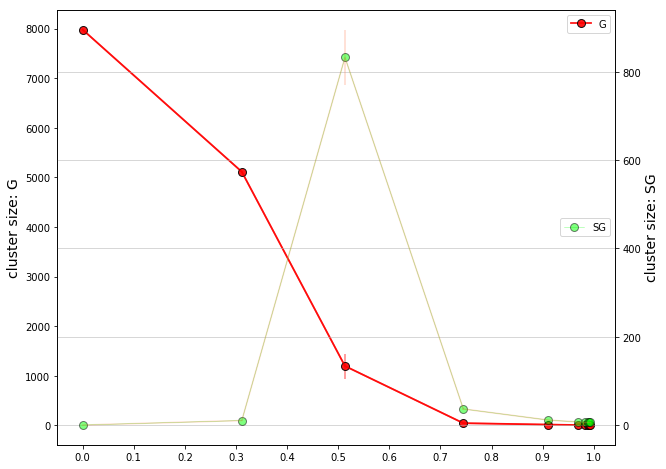

# Imports


```python
import osmnx as ox
import pandas as pd
from matplotlib import pyplot as plt
import seaborn as sns
import numpy as np
import networkx as nx
```

# Get Manhattan Road Network


```python
G = ox.graph_from_place('Manhattan Island, New York City, New York, USA', network_type='drive',simplify=True)
colors=ox.plot.get_edge_colors_by_attr(G,'length',cmap='viridis')
fig=ox.plot_graph(G,fig_height=15,fig_width=10,bgcolor='black',edge_color=colors)
```


## Get edge information, plot histogram of number of lanes.


```python
elist=G.edges.values()
blah=[e for e in elist]
edf=pd.DataFrame(blah)
with plt.style.context('dark_background'):
    plt.hist(pd.to_numeric(edf.lanes.dropna(),errors='coerce').dropna(),edgecolor='k')
plt.ylabel("Number of roads")
plt.xlabel("Number of lanes")
```


    Text(0.5,0,'Number of lanes')


## Start cleaning up the Manhattan network for analysis


```python
#elist=[edge for edge in uG.edges]
#pick=np.random.randint(len(elist),size=3000)
#droplist=[elist[num] for num in pick]
#uGp=uG.copy()
#uGp.remove_edges_from(droplist)

lanes_blah=[]
for b in blah:
    try:
        if b['lanes']:
            lanes_blah.append(b)
    except KeyError:
        pass

df=pd.DataFrame(lanes_blah)
df2=pd.DataFrame(blah)

street_names=(pd.unique(df2.name[np.array([np.shape(df2.name[i])==() for i in range(len(df2.name))])].dropna()))

df2.head()
#df2[np.array(df2.width.dropna().index)]

df=df2.dropna(subset=['lanes'])
df=df.drop(['ref','junction','access','bridge','geometry','service','tunnel','width','osmid'],axis=1)
df2=df2.drop(['ref','junction','access','bridge','geometry','service','tunnel','width','osmid'],axis=1)
```


```python
import seaborn as sns
```


```python
for i,val in enumerate(df.lanes):
    if(len(val)>1):
        df.set_value(df.index.astype(int)[i],'lanes',val[0])
```

    /Users/dyanni3/anaconda/envs/OSMNX/lib/python3.6/site-packages/ipykernel/__main__.py:3: FutureWarning: set_value is deprecated and will be removed in a future release. Please use .at[] or .iat[] accessors instead
      app.launch_new_instance()


```python
for i,val in enumerate(df.maxspeed):
    if(type(val)==str):
        df.set_value(df.index.astype(int)[i],'maxspeed',float(val.split(' ')[0]))
    elif(type(val)==list):
        df.set_value(df.index.astype(int)[i],'maxspeed',float(val[0].split(' ')[0]))
for i,val in enumerate(df.highway):
    if type(val)!=str:
        df.set_value(df.index.astype(int)[i],'highway',val[0])

```

    /Users/dyanni3/anaconda/envs/OSMNX/lib/python3.6/site-packages/ipykernel/__main__.py:3: FutureWarning: set_value is deprecated and will be removed in a future release. Please use .at[] or .iat[] accessors instead
      app.launch_new_instance()
    /Users/dyanni3/anaconda/envs/OSMNX/lib/python3.6/site-packages/ipykernel/__main__.py:5: FutureWarning: set_value is deprecated and will be removed in a future release. Please use .at[] or .iat[] accessors instead
    /Users/dyanni3/anaconda/envs/OSMNX/lib/python3.6/site-packages/ipykernel/__main__.py:8: FutureWarning: set_value is deprecated and will be removed in a future release. Please use .at[] or .iat[] accessors instead


```python
df.oneway=df.oneway.astype(int)
```


```python
df.lanes=pd.to_numeric(df.lanes)
clean_dat=pd.get_dummies(df.drop('name',axis=1))
```

## Now the dataframe "clean dat" contains necessary information

### Next going to make a training set and test set and use Random Forest to impute lane information


```python
Xtot=clean_dat.drop('lanes',axis=1)
ytot=clean_dat['lanes']
```


```python
from sklearn.cross_validation import train_test_split as tts
```

    /Users/dyanni3/anaconda/envs/OSMNX/lib/python3.6/site-packages/sklearn/cross_validation.py:41: DeprecationWarning: This module was deprecated in version 0.18 in favor of the model_selection module into which all the refactored classes and functions are moved. Also note that the interface of the new CV iterators are different from that of this module. This module will be removed in 0.20.
      "This module will be removed in 0.20.", DeprecationWarning)


```python
train,test=tts(clean_dat)
Xtrain=train.drop('lanes',axis=1)
ytrain=train['lanes']
Xtest=test.drop('lanes',axis=1)
ytest=test['lanes']
```


```python
from sklearn.linear_model import LogisticRegression as LR
from sklearn.ensemble import RandomForestClassifier as RFC
from sklearn.ensemble import VotingClassifier as VC
from sklearn.ensemble import RandomForestRegressor as RFR
model=LR(class_weight='balanced',C=.5)
model.fit(Xtrain,ytrain)
model2=RFC(class_weight='balanced')
model2.fit(Xtrain,ytrain)
rfr=RFR()
rfr.fit(Xtrain,ytrain)
```


    RandomForestRegressor(bootstrap=True, criterion='mse', max_depth=None,
               max_features='auto', max_leaf_nodes=None,
               min_impurity_decrease=0.0, min_impurity_split=None,
               min_samples_leaf=1, min_samples_split=2,
               min_weight_fraction_leaf=0.0, n_estimators=10, n_jobs=1,
               oob_score=False, random_state=None, verbose=0, warm_start=False)


```python
LRpred=model.predict(Xtest)
RFCpred=model2.predict(Xtest)
RFRpred=rfr.predict(Xtest)
```


```python
with plt.style.context('dark_background'):
    plt.figure(figsize=(10,10))
    #plt.scatter(RFRpred,ytest+np.random.normal(0,.05,len(ytest)),s=.5,c='g')
    #plt.plot(np.arange(7),np.arange(7),'r--')
    sns.regplot(RFRpred,ytest,scatter_kws={'s':100,'alpha':.2},ci=99,y_jitter=0,x_jitter=0,fit_reg=True)
    plt.xlabel('predicted lanes',fontsize=18)
    plt.ylabel('actual num lanes',fontsize=18)
```


```python
from sklearn.metrics import r2_score, classification_report, accuracy_score
```


```python
print(r2_score(LRpred,ytest))
#print(r2_score(weighted_pred,ytest))
print(r2_score(RFRpred,ytest))
```

    0.455333837065531
    0.6521955627228441


```python
print(accuracy_score([round(i) for i in RFRpred],ytest))
```

    0.6190476190476191


```python
jointplotdata=pd.DataFrame({'predicted number of lanes':RFRpred,'actual number of lanes':ytest.values})
with plt.style.context('dark_background'):
    #with plt.style.context('seaborn-pastel'):
    kdefig=sns.jointplot(x="predicted number of lanes",y='actual number of lanes',data=jointplotdata,kind='kde',cmap='bone',color='steelblue')
    #hexplot = sns.jointplot(x, y, kind="hex")
    #plt.subplots_adjust(left=0.2, right=0.8, top=0.8, bottom=0.2)  # shrink fig so cbar is visible
    #cax = kdefig.fig.add_axes([.85, .25, .05, .4])  # x, y, width, height
    #plt.colorbar(cax=cax)
```


# Now use the regressor to impute lane information


```python
topred=df2[df2.lanes.isna()]

topred=topred.drop('lanes',axis=1)

for i,val in enumerate(topred.maxspeed):
    if(type(val)==str):
        topred.set_value(topred.index.astype(int)[i],'maxspeed',float(val.split(' ')[0]))
    elif(type(val)==list):
        topred.set_value(topred.index.astype(int)[i],'maxspeed',float(val[0].split(' ')[0]))
for i,val in enumerate(topred.highway):
    if type(val)!=str:
        topred.set_value(topred.index.astype(int)[i],'highway',val[0])

topred=pd.get_dummies(topred.drop('name',axis=1))

for col_name in [i for i in Xtrain.columns if i not in topred.columns]:
    topred[col_name]=0
for col_name in [i for i in topred.columns if i not in Xtrain.columns]:
    topred=topred.drop(col_name,axis=1)
```

    /Users/dyanni3/anaconda/envs/OSMNX/lib/python3.6/site-packages/ipykernel/__main__.py:7: FutureWarning: set_value is deprecated and will be removed in a future release. Please use .at[] or .iat[] accessors instead
    /Users/dyanni3/anaconda/envs/OSMNX/lib/python3.6/site-packages/ipykernel/__main__.py:9: FutureWarning: set_value is deprecated and will be removed in a future release. Please use .at[] or .iat[] accessors instead
    /Users/dyanni3/anaconda/envs/OSMNX/lib/python3.6/site-packages/ipykernel/__main__.py:12: FutureWarning: set_value is deprecated and will be removed in a future release. Please use .at[] or .iat[] accessors instead


```python
predicted_lanes=rfr.predict(topred)
```


```python
j=0
for i,val in enumerate(df2.lanes):
    try:
        if(np.isnan(float(val))):
            df2.set_value(df2.index.astype(int)[i],'lanes',predicted_lanes[j])
            j+=1
    except TypeError:
        pass
        
```


```python
final_edges_data=df2
```


```python
graphs=ox.nx.connected_component_subgraphs(uG)
```


```python
subgraph_sizes=[ox.nx.number_of_edges(i) for i in list(graphs)]
```


```python
G.number_of_edges()
#subgraph_sizes
```


    9721


# Now the number of lanes info for each edge has been filled in. Next going to define obstacle percolation function as in Eq. 1 of the text


```python
def pperc(L,s,l,rho):
    n=rho*L
    inner=L*s-.5*s**2
    inner=2*inner/(L**2)
    inner=inner**(l-1)
    outer=1-inner
    outer=outer**(n**l)
    return(1-outer)
```


```python
plt.figure(figsize=(10,5))
rho=np.linspace(0,.06,100)
plt.plot(rho,pperc(1000,7,2,rho),'r--')
plt.grid()
```


# Begin analyzing street network.

### road_probs is filled in according to the number of lanes, length, and density on each road according to Eq. 1


```python
road_probs=[]
for i in range(len(final_edges_data)):
    l=final_edges_data[['lanes','length']].iloc[i]['lanes']
    L=final_edges_data[['lanes','length']].iloc[i]['length']
    if type(L)==list:
        L=L[0]
    if type(l)==list:
        l=l[0]
    road_probs.append(pperc(float(L),7,float(l),.01))
```

### Drop roads from the network based on road_probs


```python
drops=[]
for p in road_probs:
    if np.random.random()>np.real(p):
        drops.append(True)
    else:
        drops.append(False)
```


```python
elist=[edge for edge in G.edges]
droplist=[elist[i] for i in np.where(drops)[0]]
uGp=G.copy()
uGp.remove_edges_from(droplist)
```


```python
ox.plot_graph(uGp)
```


    (<Figure size 259.739x432 with 1 Axes>,
     <matplotlib.axes._subplots.AxesSubplot at 0x1a14e12780>)


```python
uGp=nx.to_undirected(uGp)
print(nx.number_connected_components(uGp))
print(max([nx.number_of_edges(ob) for ob in nx.connected_component_subgraphs(uGp)]))
```

    1842
    76


# Now repeat the road_probs and drop procedure for many trials to build up statistics necessary for fig 3


```python
print("getting l and L...")
ls=[]
Ls=[]

for i in range(len(final_edges_data)):
    l=final_edges_data[['lanes','length']].iloc[i]['lanes']
    L=final_edges_data[['lanes','length']].iloc[i]['length']
    if type(L)==list:
        L=L[0]
    if type(l)==list:
        l=l[0]
    ls.append(l)
    Ls.append(L)
    
```

    getting l and L...


```python
#increase num trials and densities as necessary
num_trials=5
num_densities=10
densities=np.linspace(0,.08,num_densities)
num_components=np.zeros((num_densities,num_trials))
biggest_comp=np.zeros((num_densities,num_trials))

print("starting trials...")

for this_density in range(num_densities):
    rho=densities[this_density]
    road_probs=[]
    print("Getting road probabilities, %s ..."%(str(round(rho,3))))
    for i in range(9666):
        road_probs.append(pperc(float(Ls[i]),7,float(ls[i]),rho))
    for this_trial in range(num_trials):
        print("running density: %s, trial %d"%(str(round(rho,3)),this_trial))
        drops=[]
        for p in road_probs:
            if np.random.random()<np.real(p):
                drops.append(True)
            else:
                drops.append(False)

        elist=[edge for edge in G.edges]
        droplist=[elist[i] for i in np.where(drops)[0]]
        uGp=G.copy()
        uGp.remove_edges_from(droplist)
        uGp=nx.to_undirected(uGp)
        
        num_components[this_density,this_trial]=nx.number_connected_components(uGp)
        biggest_comp[this_density,this_trial]=max([nx.number_of_edges(ob) for ob in nx.connected_component_subgraphs(uGp)])
```

    starting trials...
    Getting road probabilities, 0.0 ...
    running density: 0.0, trial 0
    running density: 0.0, trial 1
    running density: 0.0, trial 2
    running density: 0.0, trial 3
    running density: 0.0, trial 4
    Getting road probabilities, 0.009 ...
    running density: 0.009, trial 0
    running density: 0.009, trial 1
    running density: 0.009, trial 2
    running density: 0.009, trial 3
    running density: 0.009, trial 4
    Getting road probabilities, 0.018 ...
    running density: 0.018, trial 0
    running density: 0.018, trial 1
    running density: 0.018, trial 2
    running density: 0.018, trial 3
    running density: 0.018, trial 4
    Getting road probabilities, 0.027 ...
    running density: 0.027, trial 0
    running density: 0.027, trial 1
    running density: 0.027, trial 2
    running density: 0.027, trial 3
    running density: 0.027, trial 4
    Getting road probabilities, 0.036 ...
    running density: 0.036, trial 0
    running density: 0.036, trial 1
    running density: 0.036, trial 2
    running density: 0.036, trial 3
    running density: 0.036, trial 4
    Getting road probabilities, 0.044 ...
    running density: 0.044, trial 0
    running density: 0.044, trial 1
    running density: 0.044, trial 2
    running density: 0.044, trial 3
    running density: 0.044, trial 4
    Getting road probabilities, 0.053 ...
    running density: 0.053, trial 0
    running density: 0.053, trial 1
    running density: 0.053, trial 2
    running density: 0.053, trial 3
    running density: 0.053, trial 4
    Getting road probabilities, 0.062 ...
    running density: 0.062, trial 0
    running density: 0.062, trial 1
    running density: 0.062, trial 2
    running density: 0.062, trial 3
    running density: 0.062, trial 4
    Getting road probabilities, 0.071 ...
    running density: 0.071, trial 0
    running density: 0.071, trial 1
    running density: 0.071, trial 2
    running density: 0.071, trial 3
    running density: 0.071, trial 4
    Getting road probabilities, 0.08 ...
    running density: 0.08, trial 0
    running density: 0.08, trial 1
    running density: 0.08, trial 2
    running density: 0.08, trial 3
    running density: 0.08, trial 4


```python
plt.loglog(biggest_comp,num_components,'bo')
plt.ylabel("number of connected components")
plt.xlabel("size of biggest component")
plt.grid()
```


```python
with plt.style.context('dark_background'):
    plt.figure(figsize=(12,8))
    plt.errorbar(x=1000*densities,y=np.average(num_components,axis=1),yerr=np.std(num_components,axis=1))
    plt.xlabel("Number of hacked cars per kilometer per lane",fontsize=14)
    plt.ylabel("number of connected components",fontsize=14)
    plt.grid(c='gray',lw=.5)
```


```python
num_trials=5
num_densities=10
densities=np.linspace(0,.08,num_densities)
num_components_fine=np.zeros((num_densities,num_trials))
G_size=np.zeros((num_densities,num_trials))
SG_size=np.zeros((num_densities,num_trials))
q=np.zeros(num_densities)

print("starting trials...")

for this_density in range(num_densities):
    rho=densities[this_density]
    road_probs=[]
    print("Getting road probabilities, %s ..."%(str(round(rho,3))))
    for i in range(9666):
        road_probs.append(pperc(float(Ls[i]),14,float(ls[i]),rho))
    q[this_density]=np.average(road_probs)
    for this_trial in range(num_trials):
        print("running density: %s, trial %d"%(str(round(rho,3)),this_trial))
        drops=[]
        for p in road_probs:
            if np.random.random()<np.real(p):
                drops.append(True)
            else:
                drops.append(False)

        elist=[edge for edge in G.edges]
        droplist=[elist[i] for i in np.where(drops)[0]]
        uGp=G.copy()
        uGp.remove_edges_from(droplist)
        uGp=nx.to_undirected(uGp)
        
        num_components_fine[this_density,this_trial]=nx.number_connected_components(uGp)
        this_list=[nx.number_of_edges(ob) for ob in nx.connected_component_subgraphs(uGp)]
        G_size[this_density,this_trial]=max(this_list)
        if len(this_list)>1:
            this_list.remove(max(this_list))
            SG_size[this_density,this_trial]=max(this_list)
        else:
            SG_size[this_density,this_trial]=0
```

    starting trials...
    Getting road probabilities, 0.0 ...
    running density: 0.0, trial 0


    /Users/dyanni3/anaconda/envs/OSMNX/lib/python3.6/site-packages/ipykernel/__main__.py:17: ComplexWarning: Casting complex values to real discards the imaginary part


    running density: 0.0, trial 1
    running density: 0.0, trial 2
    running density: 0.0, trial 3
    running density: 0.0, trial 4
    Getting road probabilities, 0.009 ...
    running density: 0.009, trial 0
    running density: 0.009, trial 1
    running density: 0.009, trial 2
    running density: 0.009, trial 3
    running density: 0.009, trial 4
    Getting road probabilities, 0.018 ...
    running density: 0.018, trial 0
    running density: 0.018, trial 1
    running density: 0.018, trial 2
    running density: 0.018, trial 3
    running density: 0.018, trial 4
    Getting road probabilities, 0.027 ...
    running density: 0.027, trial 0
    running density: 0.027, trial 1
    running density: 0.027, trial 2
    running density: 0.027, trial 3
    running density: 0.027, trial 4
    Getting road probabilities, 0.036 ...
    running density: 0.036, trial 0
    running density: 0.036, trial 1
    running density: 0.036, trial 2
    running density: 0.036, trial 3
    running density: 0.036, trial 4
    Getting road probabilities, 0.044 ...
    running density: 0.044, trial 0
    running density: 0.044, trial 1
    running density: 0.044, trial 2
    running density: 0.044, trial 3
    running density: 0.044, trial 4
    Getting road probabilities, 0.053 ...
    running density: 0.053, trial 0
    running density: 0.053, trial 1
    running density: 0.053, trial 2
    running density: 0.053, trial 3
    running density: 0.053, trial 4
    Getting road probabilities, 0.062 ...
    running density: 0.062, trial 0
    running density: 0.062, trial 1
    running density: 0.062, trial 2
    running density: 0.062, trial 3
    running density: 0.062, trial 4
    Getting road probabilities, 0.071 ...
    running density: 0.071, trial 0
    running density: 0.071, trial 1
    running density: 0.071, trial 2
    running density: 0.071, trial 3
    running density: 0.071, trial 4
    Getting road probabilities, 0.08 ...
    running density: 0.08, trial 0
    running density: 0.08, trial 1
    running density: 0.08, trial 2
    running density: 0.08, trial 3
    running density: 0.08, trial 4


```python
with plt.style.context('dark_background'):
    plt.figure(figsize=(12,8))
    plt.errorbar(x=1000*densities,y=np.average(G_size,axis=1)/biggest_comp[0,0],yerr=np.std(G_size,axis=1)/G_size[0,0])
    plt.xlabel("Number of hacked cars per kilometer per lane",fontsize=14)
    plt.ylabel(r"$\frac{size\,\, of \,\,largest\,\, comp}{size\,\, of\,\, full \,\,network}$",fontsize=14)
    plt.grid(c='gray',lw=.5)
```


# Now visualize a "broken" street network


```python
rho=0.016
road_probs=[]
print("Getting road probabilities, %s ..."%(str(round(rho,3))))
for i in range(9666):
    road_probs.append(pperc(float(Ls[i]),14,float(ls[i]),rho))
fig=ox.plot_graph(G,edge_color=list(map(plt.cm.bone,1-np.real(road_probs))),fig_height=15,fig_width=8,node_alpha=0,bgcolor='black')
```

    Getting road probabilities, 0.016 ...


```python
road_probs=[pperc(float(Ls[i]),7,float(ls[i]),0.005) for i in range(9666)]
```


```python
ecolors=[[] for i in range(len(uGp.edges))]
colors=list(map(plt.cm.rainbow,list(np.random.random(10000))))
for i,ob in enumerate(nx.connected_component_subgraphs(uGp)):
    print(i)
    for j,edge in enumerate(uGp.edges):
        if edge in ob.edges:
            ecolors[j]=colors[i]
```


```python
ox.plot_graph(uGp,node_alpha=0,bgcolor='black',edge_color=ecolors)
```


    (<Figure size 266.915x432 with 1 Axes>,
     <matplotlib.axes._subplots.AxesSubplot at 0x1a15267be0>)


```python
comp_sizes=[]

for i in range(10):
    print(i)
    drops=[]
    for p in road_probs:
        if np.random.random()<np.real(p):
            drops.append(True)
        else:
            drops.append(False)

    elist=[edge for edge in G.edges]
    droplist=[elist[i] for i in np.where(drops)[0]]
    uGp=G.copy()
    uGp.remove_edges_from(droplist)
    uGp=nx.to_undirected(uGp)

    this_list=[nx.number_of_edges(ob) for ob in nx.connected_component_subgraphs(uGp)]
    this_list.remove(max(this_list))
    comp_sizes.extend(this_list)
```

    0
    1
    2
    3
    4
    5
    6
    7
    8
    9


```python
dat=plt.hist(comp_sizes,bins=100)
```


```python
num_densities=10
densities=1000*np.linspace(0,.08,num_densities)
midc_blue=np.array([.1,.1,.8,1])
#with plt.style.context('seaborn-poster'):
#ax1=plt.plot()
plt.figure(figsize=(6,4.5))
plt.errorbar(densities,y=np.average(G_size,axis=1),yerr=np.std(G_size,axis=1),color=np.array([120,120,255])/255,alpha=.7)
plt.plot(densities,np.average(G_size,axis=1),color=np.array([120,120,255])/255,marker='o',lw=.3,mec=np.array([120,120,255])/255,ms=6,alpha=.5)
#ax2=ax1.twinx()
plt.plot(densities,np.average(SG_size,axis=1),c='k',marker='v',alpha=.7,mec='k',ms=4,lw=.3)
plt.errorbar(densities,y=np.average(SG_size,axis=1),yerr=np.std(SG_size,axis=1),color=midc_blue,alpha=.7)
plt.xticks([10*i for i in range(9)])
plt.yticks([1000*i for i in range(9)])
plt.ylabel("cluster size",fontsize=18)
plt.xlabel(r"$\rho_H$",fontsize=18)
plt.grid('gray',lw=.1)
plt.xlim(0,30)
plt.yticks([2000*i for i in range(5)],fontsize=16)
plt.xticks(fontsize=16)
plt.legend(["Largest Component","Second Largest Component"],fontsize=14)
```


    <matplotlib.legend.Legend at 0x1a1521c518>


```python
startc=np.array([1,0,0,1])
endc=np.array([0,1,0,1])
#ax1=plt.plot()
fig,ax1=plt.subplots(figsize=(10,8))
ax1.errorbar(q,y=np.average(G_size,axis=1),yerr=np.std(G_size,axis=1),color=tuple(startc),alpha=.5)
ax1.plot(q,np.average(G_size,axis=1),color=tuple(startc),marker='o',lw=1.8,mec='k',ms=8,alpha=.9)
ax2=ax1.twinx()
ax2.plot(q,np.average(SG_size,axis=1),c=tuple(endc),marker='o',alpha=.5,mec='k',ms=8,lw=.5)
ax2.errorbar(q,y=np.average(SG_size,axis=1),yerr=.3*np.std(SG_size,axis=1),color='coral',alpha=.3)
plt.xticks([.1*i for i in range(11)])
ax1.set_ylabel("cluster size: G",fontsize=14)
ax2.set_ylabel("cluster size: SG",fontsize=14)
plt.xlabel("q")
plt.grid('gray',lw=.5)
ax1.legend(labels=["G"])
ax2.legend(labels=["SG"],loc=5)
```


    <matplotlib.legend.Legend at 0x1a14abecf8>





# Now everything for figure 3 is complete except using python google places to determine distance from node to emergency services.


```python
from googleplaces import GooglePlaces, types, lang

#YOUR_API_KEY = 'rem this on A I z a S y A D g _ b O Tei5s9nWXGQRfGr87X-P3ovTGPU'
YOUR_API_KEY = 'Get an API key from google'

google_places = GooglePlaces(YOUR_API_KEY)
```


```python
query_result = google_places.nearby_search(
        location='Manhattan', keyword='Coffee')#,
        #radius=200000)#, types=[types.TYPE_HEALTH])
```


```python
if query_result.has_attributions:
    print (query_result.html_attributions)

station_names=[]
station_locs=[]
station_ids=[]
ct=0
for place in query_result.places:
    # Returned places from a query are place summaries.
    station_names.append(place.name)
    ct+=1
    station_locs.append(place.geo_location)
    station_ids.append(place.place_id)

    # The following method has to make a further API call.
    place.get_details()
    # Referencing any of the attributes below, prior to making a call to
    # get_details() will raise a googleplaces.GooglePlacesAttributeError.
    #print (place.details) # A dict matching the JSON response from Google.
    #print (place.local_phone_number)
    #print (place.international_phone_number)
    #print (place.website)
    #print (place.url)


#ct=0
# Are there any additional pages of results?
while( query_result.has_next_page_token and ct<200):
    ct+=1
    query_result_next_page = google_places.nearby_search(
            pagetoken=query_result.next_page_token)
    print("more pages")
    for place in query_result_next_page.places:
        station_names.append(place.name)
        station_locs.append(place.geo_location)


```


```python
station_tuples=[]
for p in station_locs:
    station_tuples.append((float(p['lat']),float(p['lng'])))
```


```python
police_nodes=[ox.utils.get_nearest_node(G,station_tuples[i]) for i in range(len(station_tuples))]
```


```python
#print("length of police_nodes: "+str(len(police_nodes)))
ctr=0
num_police_in_graph=[]
for ob in nx.connected_component_subgraphs(uGp):
    ctr=0
    for node in police_nodes:
        if node in ob.nodes:
            ctr+=1
    num_police_in_graph.append((len(ob.nodes),ctr))
safe_nodes=0; risk_nodes=0;
for tup in num_police_in_graph:
    if tup[1]==0:
        risk_nodes+=tup[0]
    else:
        safe_nodes+=tup[0]
print("fraction of nodes w access to hospital: "+str(round(safe_nodes/(safe_nodes+risk_nodes),3)))
```


```python
num_trials=10
num_densities=50
densities=np.linspace(0,.08,num_densities)
frac_access_coffee=np.zeros((num_densities,num_trials))

print("starting trials...")

for this_density in range(num_densities):
    rho=densities[this_density]
    road_probs=[]
    print("Getting road probabilities, %s ..."%(str(round(rho,3))))
    for i in range(9665):
        road_probs.append(pperc(float(Ls[i]),14,float(ls[i]),rho))
    #q[this_density]=np.average(road_probs)
    for this_trial in range(num_trials):
        #print("running density: %s, trial %d"%(str(round(rho,3)),this_trial))
        drops=[]
        for p in road_probs:
            if np.random.random()<np.real(p):
                drops.append(True)
            else:
                drops.append(False)

        elist=[edge for edge in G.edges]
        droplist=[elist[i] for i in np.where(drops)[0]]
        uGp=G.copy()
        uGp.remove_edges_from(droplist)
        uGp=nx.to_undirected(uGp)
        
        ctr=0
        num_police_in_graph=[]
        for ob in nx.connected_component_subgraphs(uGp):
            ctr=0
            for node in police_nodes:
                if node in ob.nodes:
                    ctr+=1
            num_police_in_graph.append((len(ob.nodes),ctr))
        safe_nodes=0; risk_nodes=0;
        for tup in num_police_in_graph:
            if tup[1]==0:
                risk_nodes+=tup[0]
            else:
                safe_nodes+=tup[0]
        print("fraction of nodes w access to Times Square: "+str(round(safe_nodes/(safe_nodes+risk_nodes),3)))
        print("trial num: "+str(this_trial))
        frac_access_coffee[this_density,this_trial]=safe_nodes/(safe_nodes+risk_nodes)
```


```python
print("getting l and L...")
ls=[]
Ls=[]

for i in range(9665):
    l=final_edges_data[['lanes','length']].iloc[i]['lanes']
    L=final_edges_data[['lanes','length']].iloc[i]['length']
    if type(L)==list:
        L=L[0]
    if type(l)==list:
        l=l[0]
    ls.append(l)
    Ls.append(L)
```


```python
import matplotlib as mpl
mpl.rcParams.update(mpl.rcParamsDefault)
num_densities=50
densities=np.linspace(0,.08,num_densities)
#ax1=plt.plot()
plt.figure(figsize=(9,4.5))
plt.semilogy()
#plt.errorbar(q,y=np.average(G_size,axis=1),yerr=np.std(G_size,axis=1),color='g',alpha=.5)
plt.errorbar(1000*densities,y=np.average(frac_access_hosp,axis=1),yerr=np.std(frac_access_hosp,axis=1),color='white',marker='^',lw=1.8,mec='r',ms=8,alpha=.6,ecolor='pink')
plt.errorbar(1000*densities,y=np.average(frac_access_fire,axis=1),yerr=np.std(frac_access_fire,axis=1),color='red',marker='o',lw=1.8,mec='k',ms=8,alpha=.6)
plt.errorbar(1000*densities,y=np.average(frac_access_ts,axis=1),yerr=np.std(frac_access_ts,axis=1)/1.5,color='gray',marker='s',lw=1.8,mec='k',ms=8,alpha=.6)
plt.errorbar(1000*densities,y=np.average(frac_access_coffee,axis=1),yerr=np.std(frac_access_coffee,axis=1),color='saddlebrown',marker='o',lw=1.8,mec='k',ms=8,alpha=1)
#plt.semilogy(1000*densities,frac_access_police,color='cadetblue',marker='o',lw=1.8,mec='k',ms=8,alpha=.6)
#plt.semilogy(1000*densities,frac_access_coffee,color='peru',marker='o',lw=1.8,mec='k',ms=8,alpha=.6)
#plt.semilogy(1000*densities,frac_access_hindu,color='purple',marker='o',lw=1.8,mec='k',ms=8,alpha=.6)
#ax2=ax1.twinx()
#plt.plot(q,np.average(SG_size,axis=1),c='coral',marker='o',alpha=.5,mec='k',ms=8)
#plt.errorbar(q,y=np.average(SG_size,axis=1),yerr=2*np.std(SG_size,axis=1),color='coral',alpha=.5)
#plt.xticks([.1*i for i in range(11)])
plt.xticks(fontsize=16)
plt.ylim(1e-3,1e0)
#locs,_=plt.yticks()
locs=np.array([1e-4,1e-3,1e-2,1e-1,1e0])
labels=["100%","10%","1%","0.1%","0.01%"]
labels=reversed(labels)
plt.yticks(locs,labels,fontsize=16)
plt.ylabel("Percent of nodes with access",fontsize=18)
plt.xlabel(r"$\rho_H$",fontsize=18)
plt.xlim(0,60)
#plt.grid('gray',lw=.4)
plt.legend(["hospital","fire station","Times Square","coffee shop","hindu temple"],fontsize=14)
```

## making heatmap

#1 determine which sims need to be run $n_{hacked}=\frac{N_{cars}*f_{hacked}}{L_{tot}}$

$L_{tot}=\sum_{roads}^{}{n_{lanes}*length\,\, (km)}$

#2 get q for each simulation -> $q=\langle road \_ probs(n_{hacked}) \rangle$

#3 risk level $r=sigmoid(q)$, color $c = plt.cm.custom(r)$

#4 make the heatmap


```python
#1 determining which sims

#Ncars in range 10 thousand to 360,000 (max)
Ncars=np.linspace(100,360000,100)

#fraction hacked in range 0 to 1
f_hacked=np.linspace(0,1,100)

#get Ltot
Ltot=np.sum(np.array([float(l) for l in ls])*np.array(Ls))/1000

#densities to simulate
densities_matrix=np.outer(f_hacked,Ncars)/(Ltot*1000)

```


```python
#2 getting q for each simulation

q_matrix=np.zeros(densities_matrix.shape)
for i in range(100):
    for j in range(100):
        road_probs=[]
        if i%10==0 and j%50==0:
            print("Getting road probabilities, %s ..."%(str((i,j))))
        for k in range(len(Ls)):
            road_probs.append(pperc(float(Ls[k]),7,float(ls[k]),densities_matrix[i,j]))
        q_matrix[i,j]=np.average(road_probs)
```


```python


#3 and 4 determine risk level, and make the heat map
def sigmoid(q):
    return(1/(1+np.exp((-q+.4)/.06)))

risk_matrix=sigmoid(q_matrix)

f=plt.figure(figsize=(7,7))
#plt.imshow(q_matrix,cmap=test_map(reverse=True),interpolation='none')
plt.imshow(risk_matrix,cmap=blues_map(reverse=True),interpolation='none')
l1,=plt.plot(np.arange(500),20000/np.arange(1,501),c='pink',label='city fragment',linestyle='--',lw=2)
l2,=plt.plot(np.arange(500),5000/np.arange(1,501),c=midc,linestyle='--',label='traffic jams',lw=2)
plt.ylim(0,1)
yticks=[(100*i) for i in range(6)]
xticks=yticks
plt.yticks(yticks,[round(.2*i,3) for i in range(6)],fontsize=16)
plt.xticks(xticks,[72*i for i in range(6)],fontsize=16)
plt.ylabel("Fraction hacked",fontsize=18)
plt.xlabel("Total number of cars (thousands)",fontsize=18)
cb=plt.colorbar(label="Probability of Fragmentation",shrink=.6,orientation='horizontal')
cb.set_label(r"Probability of city fragmentation",fontsize=12)
plt.legend(fontsize=14)
```


```python
plt.imshow(np.flipud(densities_matrix))
plt.xlabel("Ncars")
plt.ylabel("f_hacked")
```


```python
testim=np.zeros((150,150))
for i in range(150):
    for j in range(150):
        testim[i,j]=(((i-25)*150)+(j-25))/10000
plt.imshow(testim,cmap=test_map(reverse=True))
plt.imshow(testim,cmap=blues_map(reverse=True))
```


```python
testim=np.zeros((150,150))
for i in range(150):
    for j in range(150):
        testim[i,j]=(((i-25)*150)+(j-25))/10000
plt.imshow(testim,cmap=plt.cm.Blues)
```


```python
print(frac_access_hosp.shape)
print(q[::6].shape)
```


```python
plt.figure(figsize=(8,3))
l1,=plt.plot(1000*densities,q[::6],label=r"$q$",c=custom_cm(0))
l2,=plt.plot(np.arange(80),np.ones(80)*.45,'--',label=r"$q^*$",c=custom_cm(1))
plt.grid(lw=.5)
plt.xlim(0,80)
plt.ylim(0,1.05)
plt.xticks(fontsize=14)
plt.yticks(fontsize=14)
plt.xlabel("number hacked cars per km per lane",fontsize=18)
plt.ylabel(r"$q$",fontsize=18)
plt.legend(fontsize=18)
```


```python
from scipy import io as sio
q_matrix=sio.loadmat('q_matrix.mat')
q_matrix=q_matrix['q_matrix']
q=sio.loadmat("q for dens.mat")['q']
densities=sio.loadmat("number hacked pkmpl.mat")['num']
```


```python
frac_access_hosp=sio.loadmat("frac_acc_hosp.mat")['frac']
frac_access_fire=sio.loadmat("frac_acc_fire.mat")['frac']
frac_access_ts=sio.loadmat("frac_acc_ts.mat")['frac']
frac_access_coffee=sio.loadmat("frac_acc_coffee.mat")['frac']
```


```python
sio.savemat("frac_acc_well_dist",{"frac":frac_access_well_dist})
sio.savemat("frac_acc_med_dist",{"frac":frac_access_med_dist})
```


```python
num_trials=2
num_densities=40
densities=np.linspace(0,.08,num_densities)
frac_access_em_dist=np.zeros((num_densities,num_trials))

print("starting trials...")

for this_density in range(num_densities):
    rho=densities[this_density]
    road_probs=[]
    print("Getting road probabilities, %s ..."%(str(round(rho,3))))
    for i in range(9665):
        road_probs.append(pperc(float(Ls[i]),14,float(ls[i]),rho))
    #q[this_density]=np.average(road_probs)
    for this_trial in range(num_trials):
        #print("running density: %s, trial %d"%(str(round(rho,3)),this_trial))
        drops=[]
        for p in road_probs:
            if np.random.random()<np.real(p):
                drops.append(True)
            else:
                drops.append(False)

        elist=[edge for edge in G.edges]
        droplist=[elist[i] for i in np.where(drops)[0]]
        uGp=G.copy()
        uGp.remove_edges_from(droplist)
        uGp=nx.to_undirected(uGp)
        
        ctr=0
        num_police_in_graph=[]
        for ob in nx.connected_component_subgraphs(uGp):
            ctr=0
            for node in em_dist_nodes:
                if node in ob.nodes:
                    ctr+=1
            num_police_in_graph.append((len(ob.nodes),ctr))
        safe_nodes=0; risk_nodes=0;
        for tup in num_police_in_graph:
            if tup[1]==0:
                risk_nodes+=tup[0]
            else:
                safe_nodes+=tup[0]
        print("fraction of nodes w access to Times Square: "+str(round(safe_nodes/(safe_nodes+risk_nodes),3)))
        print("trial num: "+str(this_trial))
        frac_access_em_dist[this_density,this_trial]=safe_nodes/(safe_nodes+risk_nodes)
```


```python
em_dist_nodes=[n for n in G.nodes if np.random.random()<.0038]
```


```python
num_densities=50
densities=np.linspace(0,.08,num_densities)
#ax1=plt.plot()
plt.figure(figsize=(9,4.5))
plt.semilogy()
#plt.errorbar(q,y=np.average(G_size,axis=1),yerr=np.std(G_size,axis=1),color='g',alpha=.5)
plt.errorbar(1000*densities,y=np.average(frac_access_hosp,axis=1),yerr=np.std(frac_access_hosp,axis=1),color='white',marker='^',lw=1.8,mec='r',ms=8,alpha=.6,ecolor='pink')
plt.errorbar(1000*densities,y=np.average(frac_access_fire,axis=1),yerr=np.std(frac_access_fire,axis=1),color='red',marker='o',lw=1.8,mec='k',ms=8,alpha=.6)
plt.errorbar(1000*densities,y=np.average(frac_access_ts,axis=1),yerr=np.std(frac_access_ts,axis=1)/1.5,color='gray',marker='s',lw=1.8,mec='k',ms=8,alpha=.6)
#plt.errorbar(1000*densities,y=np.average(frac_access_coffee,axis=1),yerr=np.std(frac_access_coffee,axis=1),color='saddlebrown',marker='o',lw=1.8,mec='k',ms=8,alpha=1)
plt.errorbar(1000*densities,y=np.average(frac_access_well_dist,axis=1),yerr=np.std(frac_access_well_dist,axis=1),color='purple',marker='o',lw=1.8,mec='k',ms=8,alpha=1)
#plt.errorbar(1000*densities,y=np.average(frac_access_med_dist,axis=1),yerr=np.std(frac_access_med_dist,axis=1),color='blue',marker='s',lw=1.8,mec='k',ms=8,alpha=.5)
plt.errorbar(1000*np.linspace(0,.08,40),y=np.average(frac_access_em_dist,axis=1),yerr=np.std(frac_access_em_dist,axis=1),color='green',marker='s',lw=1.8,mec='k',ms=8,alpha=.5)
#plt.semilogy(1000*densities,frac_access_police,color='cadetblue',marker='o',lw=1.8,mec='k',ms=8,alpha=.6)
#plt.semilogy(1000*densities,frac_access_coffee,color='peru',marker='o',lw=1.8,mec='k',ms=8,alpha=.6)
#plt.semilogy(1000*densities,frac_access_hindu,color='purple',marker='o',lw=1.8,mec='k',ms=8,alpha=.6)
#ax2=ax1.twinx()
#plt.plot(q,np.average(SG_size,axis=1),c='coral',marker='o',alpha=.5,mec='k',ms=8)
#plt.errorbar(q,y=np.average(SG_size,axis=1),yerr=2*np.std(SG_size,axis=1),color='coral',alpha=.5)
#plt.xticks([.1*i for i in range(11)])
plt.xticks(fontsize=16)
plt.ylim(1e-3,1e0)
#locs,_=plt.yticks()
locs=np.array([1e-4,1e-3,1e-2,1e-1,1e0])
labels=["100%","10%","1%","0.1%","0.01%"]
labels=reversed(labels)
plt.yticks(locs,labels,fontsize=16)
plt.ylabel("Percent of nodes with access",fontsize=18)
plt.xlabel(r"$\rho_H$",fontsize=18)
plt.xlim(0,60)
#plt.grid('gray',lw=.4)
plt.legend(["hospital","fire station","Times Square","random 10%","random 0.5%"],fontsize=14)
```

# Now figure 3 complete, going to look at Macy's parade data


```python
# Data manipulation
import pandas as pd
import numpy as np

# Timestamps
from datetime import datetime, timedelta

# City network and plots
import osmnx as ox, geopandas as gdp
import matplotlib.pyplot as plt

# To replace output plots for streaming
from IPython import display

# Sets intervals for updating the plot
import time

%matplotlib inline
```


```python
# Where the web scraper script is outputting files
streamFilePath = "/Users/dyanni3/Documents/GitHub/Blog/traffic_stream_data/"

# Number of seconds for Spark to ingest the data files
microBatchSeconds = 30
```


```python
# Retrieving the network for Manhattan
manhattan = ox.graph_from_place('Manhattan, New York, USA', network_type='drive')

# Projecting the network for a top-down view
manhattan_projected = ox.project_graph(manhattan)

# Importing only the fields we're interested in
dfNodes = pd.read_csv('/Users/dyanni3/Documents/GitHub/Blog/traffic_stream_data/nycTraffic_20180910-132111.txt',
            usecols=[0, 6, 11],
            names=['id', 'linkPoints', 'borough'])

# Filtering to Manhattan and dropping the borough column
dfNodes = dfNodes[dfNodes['borough'] == 'Manhattan']
dfNodes = dfNodes[['id', 'linkPoints']]

# Splitting the column containing all Lat/Long combinations
dfNodes['splitPoints'] = dfNodes['linkPoints'].apply(lambda x: x.split(' '))

# Reshaping our data frame to have a row for each Lat/Long point
idNodes = []
for x,y in zip(dfNodes['splitPoints'], dfNodes['id']):
    for a in np.arange(len(x)):
        idNodes.append((y, x[a]))
dfNodes = pd.DataFrame(idNodes, columns=['id', 'LatLong'])

dfNodes = dfNodes.replace('', np.NaN).dropna()

# Parsing Lat/Long into individual columns
# Longitude has an if statement since some records contain '-' for longitude
dfNodes['Latitude'] = dfNodes['LatLong'].apply(lambda x: x.split(';')[0])
dfNodes['Longitude'] = dfNodes['LatLong'] \
    .apply(lambda x: x.split(';')[1] if len(x.split(';')) > 1 else None)

# Dropping incorrect longitude records and converting everything to floats
dfNodes = dfNodes[dfNodes['Longitude'] != '-'][['id', 'Latitude', 'Longitude']].astype(float)
dfNodes.dropna();

# Obtaining the nearest nodes in the network from the Lat/Long points
nodes = []
for row in dfNodes.iterrows():
    try:
        nearest_node = ox.get_nearest_node(manhattan, (dfNodes['Latitude'].ix[row], 
                                                   dfNodes['Longitude'].ix[row]))
        nodes.append(nearest_node)
    except ValueError:
        nodes.append(np.NaN)
    

dfNodes['node'] = nodes

# Removing duplicate nodes
dfNodes.drop_duplicates(subset='Node', inplace=True)
dfNodes.dropna(inplace=True)

dfNodes['linkPoints ID']=dfNodes['id']
dfNodes.drop('id',axis=1)

dfNodes.to_csv('linkPoints_to_latLong.csv')
```


```python
path_to_traffic_data = '/Users/dyanni3/Documents/GitHub/Blog/traffic_stream_data/'
glob_string = path_to_traffic_data+'*.txt'
import glob
files = glob.glob('/Users/dyanni3/Documents/GitHub/Blog/traffic_stream_data/*.txt');
```


```python
col_names = ['linkpoints','speed','lp2','linkID','lat-long-pairs','borough']
df = pd.concat([pd.read_csv(f,usecols=[0,1,2,5,6,11],names=col_names,header=None) for f in files])
```


```python
lat = []; long=[];
for i,row in enumerate(df.iterrows()):
        ll=(np.array(row[1]['lat-long-pairs'].split(' ')[0].split(';'),dtype='float'))
        lat.append(ll[0])
        long.append(ll[1])
df['lat']=pd.Series(lat)
df['long']=pd.Series(long)
df=df[df['borough']=='Manhattan'];
```


```python
nodes = []
for row in df.iterrows():
    try:
        nearest_node = ox.get_nearest_node(manhattan, (df['lat'].iloc[row[0]], 
                                                   df['long'].iloc[row[0]]))
        nodes.append(nearest_node)
    except ValueError:
        nodes.append(np.NaN)
df['node'] = nodes
df.head()
```


```python
df.hist('speed')
```


```python
nov_data_path='/Users/dyanni3/Downloads/november2016.csv'
```


```python
novData=pd.read_csv(nov_data_path)
novData.head()
```


```python
date=[]
time=[]
for splitted in (novData['DataAsOf']).apply(lambda x: x.split(' ')):
    date.append(splitted[0])
    time.append(splitted[1])

novData['date']=pd.Series(date)
novData['time']=pd.Series(time)
novData.drop('DataAsOf',axis=1,inplace=True);
novData['Speed']=pd.to_numeric(novData.Speed);
novData.head()
```


```python
novData[novData['date']=='11/3/2016'].hist('Speed')
novData[novData['date']=='11/18/2016'].hist('Speed')
```


```python
novData=novData[novData['Speed']<100]
```


```python
macy_lat=40.45040; macy_long=73.59221
```


```python
ox.get_nearest_node(manhattan,(macy_lat,macy_long))
```


```python
def euclidean(l1,l2):
    r2=(l1-macy_lat)**2 + (l2-macy_long)**2
    return(r2**.5)

```


```python
idx=np.argmin(euclidean(df.lat,df.long))
d=np.min(euclidean(df.lat,df.long))
print("idx==%d  d==%s"%(idx,str(d)))
```


```python
nearParadeIDs = df[euclidean(df.lat,df.long)<148.525].linkID
```


```python
novData.linkId==df.iloc[np.argmin(euclidean(df.lat,df.long))].linkID
```


```python
nearParade=novData[novData.linkId==df.iloc[np.argmin(euclidean(df.lat,df.long))].linkID]
```


```python
nearParade.hist('Speed')
```


```python
thxDay=nearParade[nearParade['date']=='11/24/2016']
thxDayNoon=[]
for i in range(50):
    thxDayNoon.append(thxDay.iloc[144+i])
thxDayNoon=pd.DataFrame(thxDayNoon)
thxDayNoon.hist("Speed")
```


```python
dates = ["11/%d/2016"%(i) for i in range(1,31)]
mean_speeds=[]
std_speeds=[]
time_range=[]
for date in dates:
    thisDay=nearParade[nearParade['date']==date]
    thisDayNoon=[]
    for i in range(thisDay.shape[0]):
        if (pd.to_datetime(thisDay.iloc[i].date+" "+thisDay.iloc[i].time) > pd.to_datetime(thisDay.iloc[i].date+" "+"12:00:00"))\
        and (pd.to_datetime(thisDay.iloc[i].date+" "+thisDay.iloc[i].time) < pd.to_datetime(thisDay.iloc[i].date+" "+"20:00:00")):
            thisDayNoon.append(thisDay.iloc[i])
    thisDayNoon=pd.DataFrame(thisDayNoon)
    try:
        mean_speeds.append(np.average(thisDayNoon.Speed))
        std_speeds.append(np.std(thisDayNoon.Speed))
    except AttributeError:
        mean_speeds.append(13)
        std_speeds.append(0)
        pass
```


```python
print(pd.to_datetime(thisDay.iloc[0].date+" "+thisDay.iloc[0].time))
print(pd.to_datetime(thisDay.iloc[1].date+" "+"12:00:00"))
pd.to_datetime(thisDay.iloc[0].date+" "+"12:00:00") < pd.to_datetime(thisDay.iloc[1].date+" "+thisDay.iloc[1].time)
```


```python
print([round(num,3) for num in mean_speeds])
```


```python
plt.plot(np.sort(mean_speeds),'o')
```


```python
spds =(list(zip(pd.to_datetime(dates),np.array(mean_speeds))))
```


```python
spds=pd.DataFrame(spds)
```


```python
plt.figure(figsize=(12,8))
plt.errorbar(np.arange(30),spds[1],yerr=std_speeds,marker='o',markersize=8,lw=0,elinewidth=.05,capsize=2,alpha=.75)
plt.scatter(23,spds[1][23],color='r',s=70)
y_av=np.ones(30)*np.average(spds[1])
plt.plot(np.arange(30),y_av,'r--')
error = 1.4*np.ones(30)*np.std(spds[1])
plt.fill_between(np.arange(30),y_av-error,y_av+error,alpha=.3)
plt.fill_between(np.arange(30),y_av-2*error,y_av+2*error,color='g',alpha=.1)
plt.grid(lw=.5)
plt.xticks(np.arange(30),dates,rotation='vertical');
plt.ylabel("Average Speed",fontsize=16)
plt.xlabel("Date",fontsize=16)
plt.ylim(20,45)
```


```python
novData.head()
```


```python
mean_speeds
```


```python
spds[1][23]

```


```python
ell = list(df.linkID)
uniq_nov_linkIds = pd.unique(novData.linkId)
sharedIDs = [uniq_nov_linkIds[i] for i in range(uniq_nov_linkIds.size) if uniq_nov_linkIds[i] in ell]
```


```python
vals = [[pd.unique(df.lat[df.linkID == sharedIDs[i]])[0],\
                      pd.unique(df.long[df.linkID == sharedIDs[i]])[0],\
                      pd.unique(df.linkID[df.linkID == sharedIDs[i]])[0]] for i in range(len(sharedIDs))]
```


```python
sharedMapDF = pd.DataFrame(vals,columns=['lat','long','linkId'])
```


```python
sharedMapDF
```


```python
import networkx as nx

```


```python
N=100 #Nodes per side
square_grid=nx.grid_2d_graph(N,N)
labels = dict( ((i,j), i + (N-1-j) * N ) for i, j in square_grid.nodes() )
nx.relabel_nodes(square_grid,labels,False)
inds=labels.keys()
vals=labels.values()
inds=sorted(inds,reverse=False)
vals=sorted(vals, reverse=False)
pos2=dict(zip(vals,inds))
nx.draw_networkx(square_grid, pos=pos2, with_labels=False, node_size = 4, node_color='red')
plt.axis('off')
plt.show()
```


```python
def Pp(rho):
    phi = .07; L=.2;
    inner = (phi**2)*(2-phi)**2
    inner=1-inner
    inner=inner**((L*2*rho)**2)
    return 1-inner
```


```python
rho = np.linspace(0,80,200)
plt.plot(rho,Pp(rho))
```


```python
len(square_grid.edges)
```


```python
num_trials=100
num_densities=30
densities=np.linspace(0,30,num_densities)
num_components_fine=np.zeros((num_densities,num_trials))
G_size=np.zeros((num_densities,num_trials))
SG_size=np.zeros((num_densities,num_trials))
q=np.zeros(num_densities)

print("starting trials...")

for this_density in range(num_densities):
    rho=densities[this_density]
    road_probs=[]
    q[this_density]=Pp(rho)
    for this_trial in range(num_trials):
        #print("running density: %s, trial %d"%(str(round(rho,3)),this_trial))
        drops=[]
        for i in range(len(square_grid.edges)):
            if np.random.random()<q[this_density]:
                drops.append(True)
            else:
                drops.append(False)

        elist=[edge for edge in square_grid.edges]
        droplist=[elist[i] for i in np.where(drops)[0]]
        uGp=square_grid.copy()
        uGp.remove_edges_from(droplist)
        uGp=nx.to_undirected(uGp)
        
        num_components_fine[this_density,this_trial]=nx.number_connected_components(uGp)
        this_list=[nx.number_of_edges(ob) for ob in nx.connected_component_subgraphs(uGp)]
        G_size[this_density,this_trial]=max(this_list)
        if len(this_list)>1:
            this_list.remove(max(this_list))
            SG_size[this_density,this_trial]=max(this_list)
        else:
            SG_size[this_density,this_trial]=0
```


```python
plt.figure(figsize=(8,6))
plt.errorbar(densities,y=np.average(G_size,axis=1),\
             yerr=np.std(G_size,axis=1),\
             color=np.array([120,120,255])/255,alpha=1,\
             elinewidth=2,capsize=3,lw=.7)
plt.plot(densities,np.average(G_size,axis=1),\
         color=np.array([120,120,255])/255,marker='o',\
         lw=0,mec=np.array([120,120,255])/255,ms=6,alpha=.5)
plt.plot(densities,np.average(SG_size,axis=1),c='k',\
         marker='v',alpha=.3,mec='k',ms=4,lw=0)
plt.errorbar(densities,y=np.average(SG_size,axis=1),\
             yerr=np.std(SG_size,axis=1),color='blue',alpha=.7,\
            lw=.3,capsize=0,elinewidth=2)
#plt.xticks([10*i for i in range(9)])
#plt.yticks([1000*i for i in range(9)])
plt.ylabel("cluster size",fontsize=18)
plt.xlabel(r"$\rho_H$",fontsize=18)
plt.grid('gray',lw=.1)
plt.xlim(0,30)
#plt.yticks([2000*i for i in range(5)],fontsize=16)
plt.yticks(fontsize=16)
plt.xticks(fontsize=16)
plt.legend(["Largest Component","Second Largest Component"],fontsize=14)
plt.title("100 by 100 grid",fontsize=20)
```


```python
nx.draw(uGp)
```


```python
dates = ["11/%d/2016"%(i) for i in range(1,31)]
mean_speeds=[]
std_speeds=[]
time_range=[]
for date in dates:
    print(date)
    thisDay=novData[novData['date']==date]
    thisDayNoon=[]
    print(thisDay.shape)
    for i in range(thisDay.shape[0]):
        if(i%10000==0):
            print(i)
        if (pd.to_datetime(thisDay.iloc[i].date+" "+thisDay.iloc[i].time) > pd.to_datetime(thisDay.iloc[i].date+" "+"12:00:00"))\
        and (pd.to_datetime(thisDay.iloc[i].date+" "+thisDay.iloc[i].time) < pd.to_datetime(thisDay.iloc[i].date+" "+"20:00:00")):
            thisDayNoon.append(thisDay.iloc[i])
    thisDayNoon=pd.DataFrame(thisDayNoon)
    try:
        mean_speeds.append(np.average(thisDayNoon.Speed))
        std_speeds.append(np.std(thisDayNoon.Speed))
    except AttributeError:
        mean_speeds.append(13)
        std_speeds.append(0)
        pass
```


```python
mean_speeds[1]=np.average(mean_speeds)
```


```python

```
